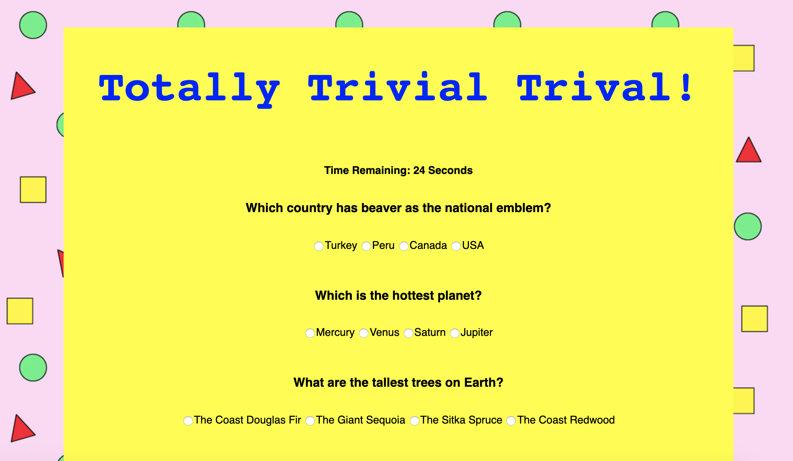

# TriviaGame

Basic Quiz (Timed Form)

-It is all multiple choice.
-The player can only choose one answer per quesitons.
-Time limit is 30 Seconds to finish the quiz.
-The game ends when the times runs out or click the done button.
-The page will reveal the number of quesiotns that player anwer correctly and incorrectly.

Enjoy!
